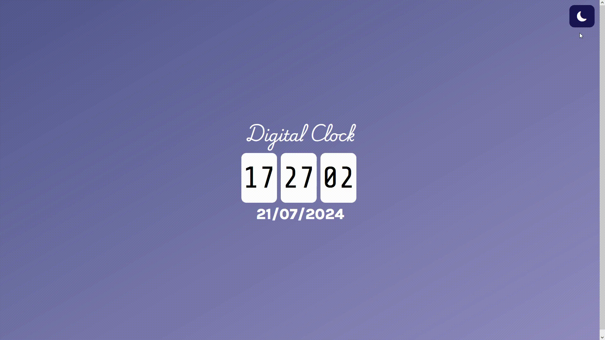

# Digital Clock / Dijital Saat

## Description / Açıklama

**English:**
This project is a digital clock application built using HTML, CSS, and JavaScript. It displays the current time and date, and also features a dark/light mode toggle.

**Türkçe:**
Bu proje, HTML, CSS ve JavaScript kullanılarak oluşturulmuş bir dijital saat uygulamasıdır. Uygulama, geçerli saati ve tarihi gösterir ve ayrıca karanlık/aydınlık mod arasında geçiş yapma özelliğine sahiptir.

---

## Features / Özellikler

**English:**
- **Digital Time and Date**: Shows hours, minutes, seconds, and the current date.
- **Dark/Light Mode Toggle**: Allows users to switch between dark and light mode.
- **Automatic Dark Mode**: Automatically switches to dark mode between 20:00 and 08:00.
**Türkçe:**
- **Dijital Saat ve Tarih**: Saat, dakika, saniye ve güncel tarihi gösterir.
- **Karanlık/Aydınlık Mod Geçişi**: Kullanıcının karanlık ve aydınlık mod arasında geçiş yapmasına olanak tanır.
- **Otomatik Karanlık Mod**: Saat 20:00 ile 08:00 arasında otomatik olarak karanlık moda geçer.

---

## Project Structure / Proje Yapısı

**English:**
- `index.html`: The main HTML file of the project.
- `style.css`: The stylesheet for the clock and date.
- `clock.js`: The JavaScript file containing the clock and date functions.

**Türkçe:**
- `index.html`: Projenin ana HTML dosyası.
- `style.css`: Saat ve tarih için stil dosyası.
- `clock.js`: Saat ve tarih fonksiyonlarını içeren JavaScript dosyası.

---

## License / Lisans

**English:**
This project is licensed under the MIT License. See the `../LICENSE` file for more details.

**Türkçe:**
Bu proje MIT lisansı altında lisanslanmıştır. Daha fazla bilgi için `../LICENSE` dosyasına bakın.

---
